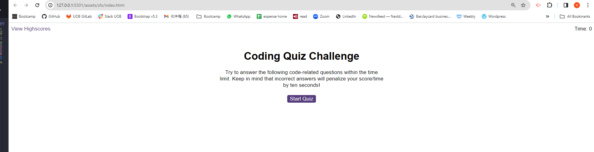
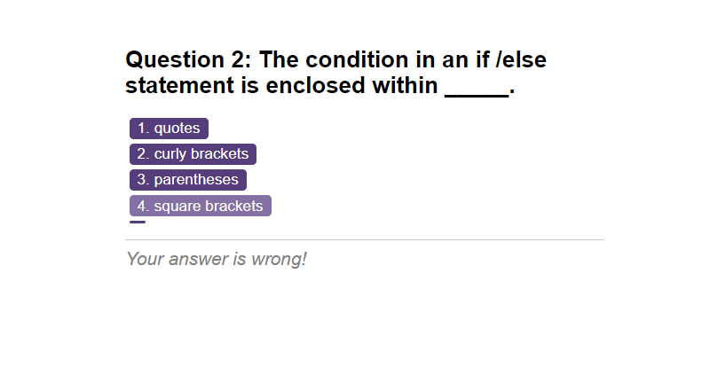
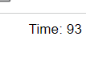
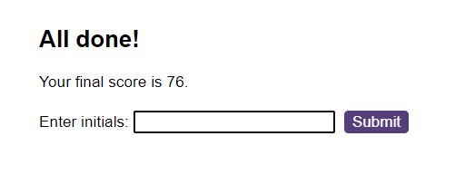
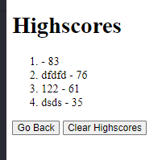

# Code Quiz

## Description 
 *Build a timed coding quiz with multiple-choice questions
 
 *Create a code quiz that contains the following requirements:

 * A start button that when clicked a timer starts and the first question appears.
 
  * Questions contain buttons for each answer.
  * 
  * When answer is clicked, the next question appears
  * 
  * If the answer clicked was incorrect then subtract time from the clock

 * The quiz should end when all questions are answered or the timer reaches 0.

  * When the game ends, it should display their score and give the user the ability to save their initials and their score

## Installation

* using JavaScript;
* using "for loop" and if statement
* linked 3 javascript files in right html files correctly

## Usage 
Link: https://vickyw0102.github.io/CodeQuizV2/ 
* showed the result there.

Result if the answer is wrong.

Timer is working 

All done page

Highscore page

## Credits

Very graceful to have below teammate and TA for working the codes together;
Thanks for @ Dylan, Pradeep, Sing and Aweas

## License

MIT licence
---

## Badges
N/A

## Features

* showed the result there.

## Contributing

N/A

## Tests

*tested all var and console logs.